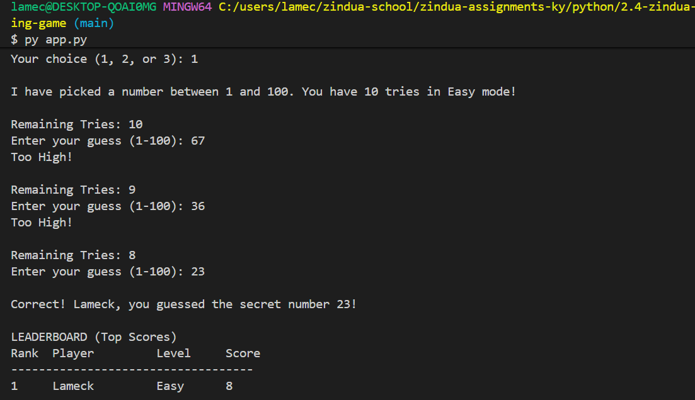

# Guess the Number CLI Game

A modular, interactive command-line "Guess the Number" game built with Python. Features robust input validation, dynamic difficulty levels, a built-in hint system, and a persistent leaderboard saved to a file.

---

## Features

- **3 Difficulty Levels**: Choose between Easy (10 tries), Medium (7 tries), and Hard (5 tries).
- **Smart Hint System**: Automatically provides a range hint (1–50 or 51–100) after 3 incorrect attempts.
- **Robust Input Validation**: Validates user inputs for blank usernames, out-of-bounds difficulty selections, and non-numeric guesses without crashing.
- **Persistent High Scores**: Automatically saves game results locally to `high_scores.txt`.
- **Top Scores Leaderboard**: Ranks player performance based on remaining attempts and displays a cleanly formatted CLI leaderboard at the end of every match.
- **Zero External Dependencies**: Built entirely using Python standard libraries (`random`, `os`).

---

## Game Rules & Difficulty Settings

The computer randomly picks a secret number between **1 and 100**. Your goal is to guess the secret number before running out of tries!

| Option | Difficulty | Tries Allowed |
| :---: | :--- | :---: |
| **1** | Easy | 10 |
| **2** | Medium | 7 |
| **3** | Hard | 5 |

- **Scoring**: Your score equals the number of attempts remaining when you guess correctly.
- **Hints**: After 3 wrong guesses, you receive a helpful range hint.

---
## Game Preview


## Prerequisites

- **Python 3.6+** installed on your system.

---

## How to Run

1. Open your terminal or command prompt.
2. Navigate to the project folder:
   ```bash
   cd path/to/your/project